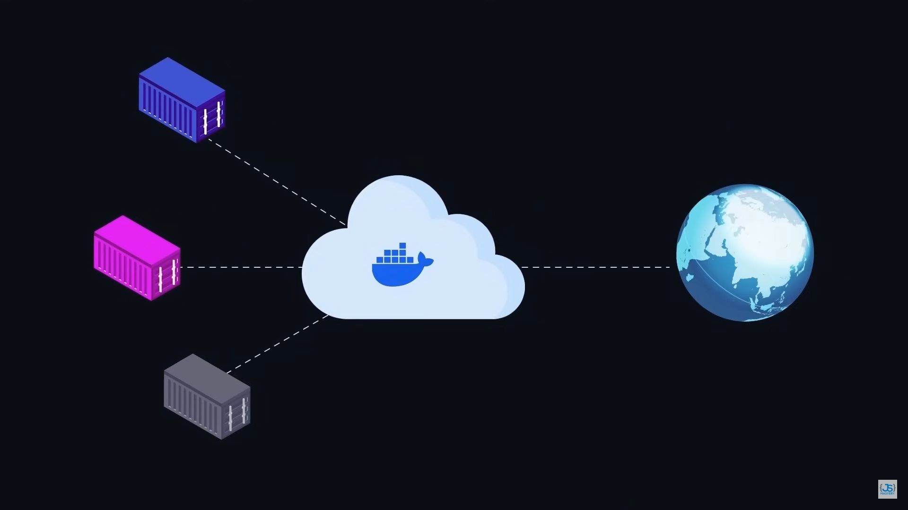

Docker is a popular platform for developing, shipping, and running applications using **containers** . It essentially provides a way to package an application with all its dependencies and libraries into a standardized unit, ensuring consistent and portable deployment across different environments. Here's a breakdown of what Docker is and how it works:

**What is a container?**

Think of a container like a shipping container. It holds everything your application needs to run – code, runtime, system tools, libraries, and settings – but in a lightweight, isolated environment. This isolation means multiple containers can share the same operating system on a host machine without interfering with each other.

**Key components of Docker:**

- **Dockerfile:** This is a text file containing instructions for building a Docker image. It specifies the steps for installing dependencies, configuring the environment, and copying your application code.
- **Docker image:** This is a blueprint for creating a container. It's built based on the instructions in the Dockerfile and contains all the necessary elements to run your application.
- **Docker container:** This is an instance of a Docker image running on a host machine. It's an isolated process with its own filesystem and resources, but shares the kernel of the host operating system.

**How does it work?**

1. **Building an image:** You create a Dockerfile and use the `docker build` command to build an image from it. This process downloads and installs all the required dependencies and configurations as specified in the Dockerfile.
2. **Running a container:** Once you have an image, you can use the `docker run` command to create a container from it. This starts the application packaged within the image.
3. **Managing containers:** Docker provides commands for starting, stopping, restarting, and managing multiple containers running on your system.

**Benefits of using Docker:**

- **Portability:** Containers run consistently across different environments, regardless of the underlying operating system, making deployment easier.
- **Isolation:** Each container runs in isolation, preventing conflicts and ensuring applications run as intended.
- **Lightweight:** Containers are much smaller and faster to start than virtual machines, leading to better resource utilization.
- **Scalability:** You can easily scale your application by adding more containers as needed.

**If you'd like to learn more, here are some resources:**

- **Docker documentation:**[https://docs.docker.com/](https://docs.docker.com/)
- **Docker tutorial for beginners:**[https://www.freecodecamp.org/news/what-is-docker-learn-how-to-use-containers-with-examples/](https://www.freecodecamp.org/news/what-is-docker-learn-how-to-use-containers-with-examples/)
- **What is Docker and How It Works?:**[https://docs.docker.com/get-started/overview/](https://docs.docker.com/get-started/overview/)

I hope this explanation helps! Feel free to ask if you have any further questions.

Sure, the image you sent me is a screenshot of a video about Docker. It depicts a typical Docker workflow, showcasing the interaction between various components involved in the process. Here's a breakdown of the key elements:

**Docker Client:** This is the software application you use to interact with Docker. It allows you to build, run, and manage Docker containers and images.

**Docker Host:** This is the machine where your Docker containers actually run. It can be your local development machine, a server in a data center, or even a cloud instance.

**Docker Daemon:** This is a background process that runs on the Docker host and manages the creation and execution of Docker containers. It listens to commands from the Docker client and carries them out.

**Docker Registry:** This is a repository where Docker images are stored and shared. You can pull pre-built images from public registries like Docker Hub, or create and push your own private images to secure registries.

**Workflow:**

1. **Building an Image:** You start by creating a Dockerfile, which specifies the instructions for building your application image. This file includes details like the base operating system, dependencies to install, and commands to run to set up your application.
2. **Pushing the Image:** Once you have a Dockerfile, you can use the `docker build` command to build an image from it. This creates a snapshot of your application environment, packaged into a single unit.
3. **Running a Container:** With the image ready, you can use the `docker run` command to create a container from it. This starts an instance of your application, running in isolation on the Docker host.
4. **Managing Containers:** The Docker client provides various commands to manage your running containers. You can start, stop, restart, pause, and even attach to a running container's console to interact with it directly.

**Additional components:**

- **Docker Hub:** This is the most popular public registry for Docker images, offering a vast library of pre-built images for various purposes.
- **Volume:** This allows you to persist data generated by your container outside its ephemeral filesystem. This is useful for storing application data or configurations that need to survive container restarts.
- **Network:** Docker containers can be connected to networks, enabling them to communicate with each other and access external resources.

I hope this explanation clarifies the diagram and provides a comprehensive understanding of the Docker workflow!

Sure, here's an explanation of the image you sent, which depicts a typical Docker workflow:

**The Docker Ecosystem**

**Components:**

- **Docker Client:** Your command-line interface to interact with Docker. Think of it as your control panel.
- **Docker Daemon:** The background process that handles building, running, and managing containers. It's the workhorse behind the scenes.
- **Docker Registry:** A storage for Docker images, like a library of pre-built application blueprints. You can find public images on Docker Hub or store private ones in your own registry.
- **Dockerfile:** A text file containing instructions for building a Docker image. It specifies the operating system, dependencies, and commands to set up your application.
- **Docker Image:** A blueprint for creating a container. It's like a recipe for your application environment.
- **Docker Container:** An isolated instance of an application running from a Docker image. Imagine it as a running instance of your application recipe.
- **Host Machine:** The physical or virtual machine where your Docker daemon runs and containers execute.

**Workflow:**

1. **Building an Image:**

- You write a Dockerfile specifying your application's needs.
- Use the `docker build` command to create an image from the Dockerfile. This instructs the Docker daemon to follow the recipe and build the image.

1. **Running a Container:**

- Use the `docker run` command with an image name to create a container. This tells the Docker daemon to cook up an instance of your application from the image recipe.
- The container runs in isolation on your host machine, with its own filesystem and resources.

1. **Additional Concepts:**

- **Volumes:** Allow persistent data storage outside the container's temporary filesystem. Imagine them as containers for your application's data that you can take with you.
- **Networks:** Connect containers to enable communication with each other or external resources. This lets your containers talk to each other and the outside world, like a restaurant with Wi-Fi.

**Benefits of Docker:**

- **Portability:** Run your application consistently across different environments with the same image.
- **Isolation:** Containers provide secure and isolated environments for your applications.
- **Scalability:** Easily scale your application by adding more containers.
- **Faster development:** Quickly spin up and tear down environments for testing and development.

I hope this explanation is helpful! Feel free to ask if you have any other questions.
